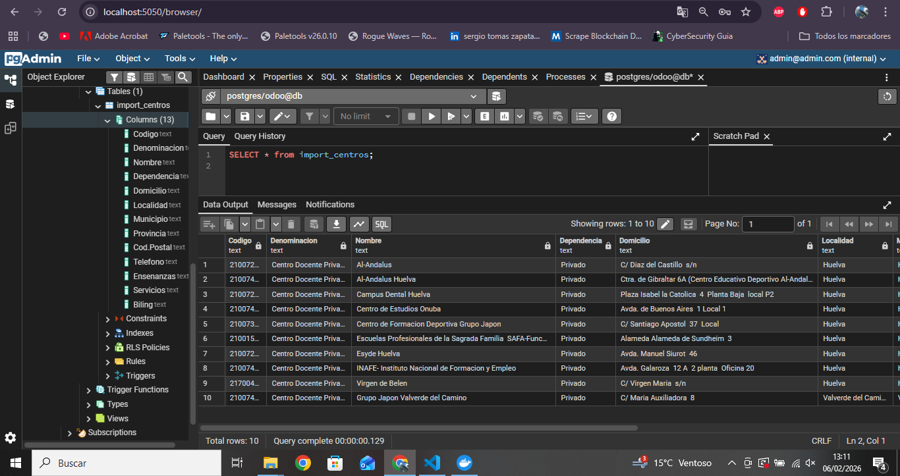
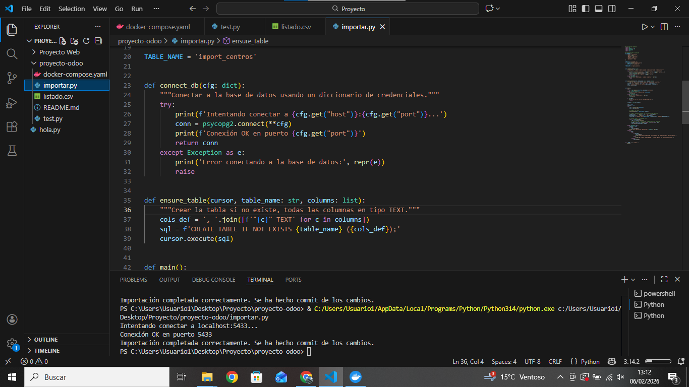

# Importación de Centros Educativos a PostgreSQL (ETL)

Resumen
------
Este repositorio contiene un script `importar.py` que realiza un proceso ETL simple para leer un CSV (por ejemplo `listado.csv`) y volcar sus registros en una tabla PostgreSQL llamada `import_centros`.

Requisitos
----------
- Python 3.10+
- Docker Desktop con contenedores de Odoo/Postgres activos
- Bibliotecas Python: `pandas`, `psycopg2-binary`

Preparar infraestructura
------------------------
Asegúrate de que Docker Desktop esté ejecutándose y que el servicio de base de datos PostgreSQL esté accesible. En este repositorio de ejemplo el `docker-compose.yaml` mapea el puerto del host `5433` al puerto del contenedor `5432`. `importar.py` intentará automáticamente conectar en los puertos `5432` y `5433` si el puerto predeterminado no funciona.

Ejecución
---------
1. Coloca `listado.csv` (o `centros_educativos.csv`) en la misma carpeta que `importar.py`.
2. Ejecuta:

```bash
python importar.py
```

Verificación en pgAdmin
-----------------------
1. Conéctate al servidor PostgreSQL desde pgAdmin (usa las mismas credenciales definidas en `DB_CONFIG`).
2. Ejecuta:

```sql
SELECT * FROM import_centros;
```

Capturas de pantalla (
-------------------------------------------





Notas
-----
- El script crea la tabla `import_centros` con todas las columnas en `TEXT` para flexibilidad.
- Inserta cada fila usando `iloc` de `pandas` y realiza `commit()` únicamente si no hubo errores durante la inserción.
- Si el CSV tiene columnas con nombres especiales, el script las delimita con comillas al crear la tabla e insertar.

